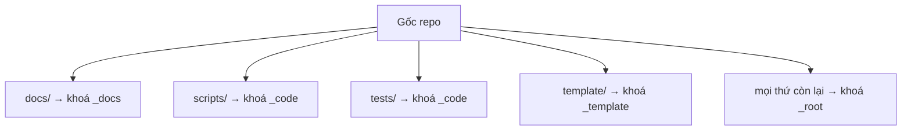
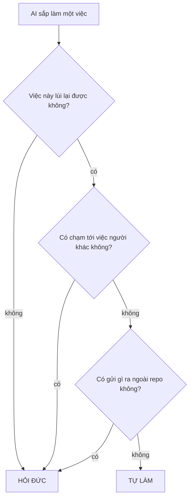

# AGENTS.md — Hiến pháp repo (đọc đầu tiên, mọi AI)

> Đây là **Tầng 1**: luật chung, cố tình giữ ngắn 1 trang. Đọc hết trước khi gõ dòng đầu tiên.
> Chi tiết kỹ thuật KHÔNG nằm ở đây — xem mục "Sổ tay mở khi cần" bên dưới.
> Chủ dự án là **Đức** (non-tech, tiếng Việt, câu ngắn). Đức là người chốt duy nhất.

## 0. Ba việc phải làm, theo đúng thứ tự

1. **Mở phiên:** đọc file này → đọc `AGENTS.md` của package mình sắp đụng → đọc `HANDOFF.md`
   của package đó (phần cuối = trạng thái mới nhất).
2. **Làm việc:** một việc một lúc. Phát sinh việc ngoài phạm vi → ghi vào `BACKLOG.md`, không tự làm.
3. **Đóng phiên:** chạy cổng kiểm dưới đây. Đỏ thì chưa xong.

```bash
node scripts/session-check.mjs --as <tên-phiên-của-bạn>
```

Không được báo "xong" khi cổng kiểm chưa xanh. Không được tự sửa cổng kiểm cho nó xanh.

**Push thì KHÔNG dùng `git push`** — dùng:

```bash
node scripts/safe-push.mjs --as <tên-phiên-của-bạn>
```

Lý do: nhiều phiên AI dùng chung một thư mục git, nên `git push` của bạn **cuốn theo commit của
mọi phiên khác** — đã xảy ra thật 26/08. `safe-push` liệt kê rõ sắp đẩy gì của ai, và từ chối
nếu bạn đang cuốn theo việc người khác.

## 1. Ai giữ package nào — chống hai AI giẫm chân

Bảng chủ sở hữu là `.agents/claims.json`. **Một vùng chỉ có MỘT phiên AI được ghi tại một thời điểm.**

**Nhận và trả quyền bằng lệnh, đừng sửa file bằng tay:**

```bash
node scripts/claim.mjs --list
node scripts/claim.mjs --take <khoá> --as <tên-phiên> --task "một câu"
node scripts/claim.mjs --release <khoá> --as <tên-phiên>
```

Sửa tay là đọc-sửa-ghi, và ngày 02/09 đã có một quyền **bị ghi đè im lặng** vì thế: hai phiên
cùng đọc thấy "trống" rồi cùng ghi tên mình, người ghi sau thắng, người ghi trước không hề biết.

- Vùng đang có chủ, mà chủ không phải bạn → **chỉ được đọc, tuyệt đối không sửa**.
- Vùng trống chủ → nhận rồi làm.
- Muốn giành vùng người khác đang giữ → **hỏi Đức**, không tự lấy.

**Gốc repo chia làm NHIỀU khoá.** Nhận đúng vùng mình đụng, không nhận cả gốc repo. Cổng đóng
phiên sẽ nói tên khoá còn thiếu. Ai chia vùng thì khai `steward` trong khối `areas` của
`.repo-structure.json`.



**Hai file được MIỄN, và lý do khác nhau:** `.agents/claims.json` (nhận/trả quyền là thao tác
hành chính — không miễn thì không ai trả lại được quyền) và `HANDOFF.md` ở gốc (luật mục 7 bắt
MỌI phiên ghi Log — nhưng **chỉ miễn khi chỉ thêm dòng**; sửa dòng cũ là viết lại lịch sử của
phiên khác).

Đây không phải hình thức: ngày 02/09 đo được **98 trong 127 commit (77%) chạm gốc repo** — một
khoá duy nhất là điểm nghẽn thật, không phải lý thuyết.

## 2. Sáu việc PHẢI hỏi Đức trước

> **Đây là BẢN DUY NHẤT của danh sách này trong cả repo.** File khác chỉ được trỏ sang đây,
> tuyệt đối không chép lại — ba bản chép tay đã từng nói ba kiểu khác nhau.

| # | Việc | Vì sao không lùi lại được |
|---|---|---|
| 1 | Xoá file, hoặc sửa dữ liệu gốc | Mất là mất, không dựng lại được |
| 2 | Đẩy kèm commit của phiên khác (`--carry`) | Công bố việc chưa ai duyệt |
| 3 | Giành vùng một phiên khác đang giữ | Người kia mất việc mà không biết |
| 4 | Gửi bất cứ gì ra ngoài (mail, tin nhắn, đăng công khai) | Ra rồi thì không rút về được |
| 5 | Tạo automation tự chạy | Nó chạy cả lúc không ai nhìn |
| 6 | Đổi luật an toàn của repo | Đổi luật là đổi thứ đang canh mọi thứ khác |

Ngoài sáu việc này, AI tự làm. Nguyên tắc phía sau: **AI tự do trong phạm vi làm repo tốt lên
và lùi lại được. Cái gì không lùi lại được, hoặc chạm tới việc người khác, thì hỏi.**



**Về mục 6 — "luật an toàn" cụ thể là năm luật này:**

- *thử lại* — hỏng thì thử mấy lần rồi bỏ
- *dừng khẩn* — gặp chuyện gì thì dừng hẳn, không đi tiếp
- *quy trách nhiệm* — mỗi việc ghi rõ ai / phiên nào làm
- *lưu trạng thái* — làm dở thì nhớ tới đâu để lần sau chạy tiếp
- *làm đúng một lần* — một việc không được chạy hai lần thành hai kết quả

**Repo bạn có phụ lục nghề (`docs/ANNEX-*.md`)?** Thì mọi việc phụ lục đó liệt kê cũng phải
hỏi. Phụ lục chỉ được **thêm** vào sáu việc trên, không được bớt.

**Commit và push được tự làm** — Đức chốt 2026-08-26, áp cho MỌI AI — nhưng chỉ khi đủ cả ba:
(1) việc đã hoàn tất trọn vẹn; (2) cổng kiểm XANH TOÀN BỘ, và với code thì đã qua audit độc lập;
(3) đẩy bằng `safe-push.mjs`. Lý do đổi luật: Đức không đọc code trên máy, GPT audit qua GitHub —
nên commit chưa push là **vô hình** với vòng kiểm tra chéo. Push sớm = được audit sớm.

Vẫn phải hỏi: force-push, sửa lịch sử, merge vào `main` — và mục 2 hàng 2 ở trên.

## 3. Năm luật vàng

1. **Không đoán.** Mọi khẳng định về một hệ thống thật phải có bằng chứng ĐO ĐƯỢC. Cần bằng
   chứng mới → tự đi lấy, đừng mượn mắt Đức. Lấy bằng cách nào là việc của phụ lục nghề.
2. **Mỗi fix một test ghim.** Và fixture phải DỰNG NỔI ca hỏng — một phép kiểm không phân
   biệt được hai nhánh là đồ trang trí, dù nó xanh.
3. **Không làm yếu lớp bảo vệ đã có** để cho test xanh. Sửa bug được; gỡ bảo vệ thì không.
4. **Kiểm chứng độc lập mọi báo cáo của AI khác.** Tự chạy lại test, tự đọc lại diff.
   Agent phụ báo "xong" không phải bằng chứng.
5. **Viết cho mắt Đức đọc.** Đức đọc không hiểu = lỗi hệ thống, viết lại đơn giản hơn.
   Chữ operator nhìn thấy: tiếng Việt. Mã lỗi (CODE): tiếng Anh.

## 4. Vùng cấm sửa

- Thư mục bằng chứng — khai `"mutability": "append-only"` trong `.repo-structure.json`.
  **Chỉ được THÊM mới**, không sửa, không xoá, không tạo lại. Tên thư mục là việc của repo bạn.
- Không bao giờ để token / mật khẩu / file pairing vào repo.
- Những điều cấm riêng của nghề repo bạn — xem `docs/ANNEX-*.md`. Chưa có phụ lục thì bỏ dòng này.

## 5. Vai từng AI

| AI | Việc chính | Không được |
|---|---|---|
| **Đức** | Chốt mọi thứ | — |
| **Claude** | Kiến trúc, phản biện, audit độc lập, điều phối | Push khi cổng kiểm chưa xanh |
| **Codex** | Code theo brief, audit độc lập | Tự mở rộng phạm vi ngoài brief |
| **Antigravity** | Dựng UI, tạo giao diện | Sửa lớp an toàn / runner / bridge |

Ba AI có thể cùng lúc trong repo, nhưng **khác package** (mục 1).

**Cửa vào của từng AI** — cách file này đến được tay bạn:

| AI | Cách nạp | Đức phải làm gì |
|---|---|---|
| Claude | Tự đọc `CLAUDE.md` gốc → trỏ sang file này | Không phải làm gì |
| Codex | Tự đọc `AGENTS.md` gốc | Không phải làm gì |
| Antigravity | Dán **một câu mở màn**: *"Đọc AGENTS.md ở gốc repo trước khi làm gì."* | Dán 1 dòng mỗi phiên |

Antigravity đã được thử live 26/08: nó tự lần ra `.agents/claims.json` và tự kết luận "package
có chủ rồi nên tôi chỉ được đọc". Luật dùng được — nhưng chưa chứng minh được nó **tự** nạp lúc
mở phiên, nên câu mở màn là bắt buộc.

## 6. Sổ tay mở khi cần — Tầng 2

> **Bảng này là BẢN ĐỒ RIÊNG CỦA REPO BẠN.** Bộ khung điền sẵn dòng cho những file nó mang
> theo. **Thêm dòng của bạn vào đây; đừng xoá cái đang đúng.** Không đọc trước cả bảng — tới
> việc nào thì mở sổ tay đó.

| Khi bạn sắp… | Mở file |
|---|---|
| Hiểu bộ khung này gồm gì và dùng thế nào | [README.md](README.md) |
| Khai trạng thái cho một đơn vị công việc | [STATUS.template.md](STATUS.template.md) |
| Ghi một quyết định kiến trúc | bản mẫu [docs/_TEMPLATE-adr.md](docs/_TEMPLATE-adr.md) · luật [docs/adr/0000-…](docs/adr/0000-ghi-nhan-quyet-dinh-kien-truc.md) |
| Viết một tài liệu nghiên cứu | [docs/_TEMPLATE-study.md](docs/_TEMPLATE-study.md) |
| Viết đề bài cho một phiên AI | [docs/_TEMPLATE-brief.md](docs/_TEMPLATE-brief.md) |
| Biết phiên trước làm tới đâu | [HANDOFF.md](HANDOFF.md) — đọc phần **cuối** file |
| Biết repo đang nợ gì về cấu trúc | chạy `npm run bootstrap` |
| **Biết còn thiếu gì để tới v1.0, và vì sao chưa gọi là v1.0** | [docs/ROADMAP-V1.md](docs/ROADMAP-V1.md) — bốn khối A→D, mỗi lỗ kèm cách chứng minh nó có thật |
| **Nhờ một AI khác brainstorm cho repo này** | [docs/briefs/BRAINSTORM-GPT-V1.md](docs/briefs/BRAINSTORM-GPT-V1.md) — dán trọn, đừng tóm tắt hộ |
| **Việc lặp lại — làm theo danh sách kiểm, đừng tự nghĩ lại** | [docs/SO-TAY-AGENT.md](docs/SO-TAY-AGENT.md) — bảy mục, mỗi mục một checklist. **Việc nào có mục ở đó thì phải làm theo mục đó** |
| **Đến hạn bảo trì, hoặc repo im ắng lâu ngày** | [docs/BAO-TRI-DINH-KY.md](docs/BAO-TRI-DINH-KY.md) — ba nhịp (mỗi phiên · mỗi tuần · mỗi tháng) và ba dấu hiệu repo xuống cấp |
| **Giải thích repo này cho người không đọc code** | [docs/TINH-NANG.md](docs/TINH-NANG.md) — mỗi tính năng kèm câu "không có nó thì hỏng ra sao" |
| **Tra một thuật ngữ** (gate · claim · lane · fail-closed…) | [docs/LEGEND.md](docs/LEGEND.md) — thuật ngữ giữ tiếng Anh, giải nghĩa tiếng Việt |
| **Mới vào, chưa biết bắt đầu từ đâu** | [docs/HUONG-DAN.md](docs/HUONG-DAN.md) — hai phần: cho người, và cho phiên AI |
| **Xem các bước của một việc, có lưu đồ** | [docs/workflows/](docs/workflows/01-dung-repo-moi.md) — [dựng repo mới](docs/workflows/01-dung-repo-moi.md) · [migrate](docs/workflows/02-dua-repo-cu-len-chuan.md) · [một phiên làm việc](docs/workflows/03-mot-phien-lam-viec.md) |
| **Biết bản này vừa đổi gì so với bản trước** | [CHANGELOG.md](CHANGELOG.md) — chỉ thêm, không sửa khối cũ |
| **Sinh một trang có hình cho người xem** — cũng là cách cho người khác xem bộ khung là gì | `npm run overview -- <file-ra.html>` rồi mở file HTML đó bằng trình duyệt. Đừng commit file HTML: nó là ảnh chụp một lúc, không phải tài liệu |
| **Đo một repo khác cách bộ khung bao xa** | `npm run assess -- <đường-dẫn-repo>` · quy trình đọc kết quả: [docs/protocols/KIEM-MOT-REPO.md](docs/protocols/KIEM-MOT-REPO.md) |
| **Dựng một repo mới từ bộ khung** | `npm run init -- <thư-mục> --ten "Tên repo"` |
| **Đưa một repo đang sống lên chuẩn** | [docs/protocols/CHUYEN-REPO-LEN-CHUAN.md](docs/protocols/CHUYEN-REPO-LEN-CHUAN.md) — **chưa từng chạy thật**, vài bước sẽ sai |
| **Sinh lại bản trích trong `template/`** | `npm run template` · chỉ kiểm không ghi: `npm run template -- --check` |
| **Biết vì sao công cụ ở đây mà không đi theo bản trích** | [docs/adr/0002](docs/adr/0002-cong-cu-va-quy-trinh-o-repo-nha.md) · vì sao bộ khung tách ra ở riêng: [docs/adr/0001](docs/adr/0001-template-o-repo-doc-lap-project-3ai-nghi.md) |
| Hiểu bộ khung tự kiểm mình bằng gì, hoặc thêm test của repo bạn | [tests/harness-smoke.mjs](tests/harness-smoke.mjs) — các khối hạt giống, chạy bằng `npm test` |

**Phải là liên kết bấm được, không phải chữ thường.** Máy kiểm xem mỗi file có được file nào
trỏ tới không; **file không ai trỏ tới thì coi như không có**. Đo thật lúc dựng bộ khung: để
bảng rỗng thì 4 file rơi ra ngoài bản đồ, kể cả chính `README.md`.

**Thêm file hoặc thư mục mới thì phải khai một dòng vào bảng này.** Không khai = không tồn tại,
và cổng đóng phiên bắt.

## 7. Đóng phiên — ghi lại 3 thứ

1. Một dòng Log vào `HANDOFF.md` của package: làm gì, kết quả số, còn gì mở.
2. Quyết định mới của Đức → `decisions.md`.
3. Gặp lỗi mới ở một hệ thống bên ngoài → thêm 1 dòng vào bảng lỗi của sổ tay, **và** cân
   nhắc thêm 1 phép kiểm vào `scripts/session-check.mjs`.

> Luật nào không kiểm được bằng máy thì sớm muộn cũng bị bỏ qua. Đó là lý do có cổng kiểm.
