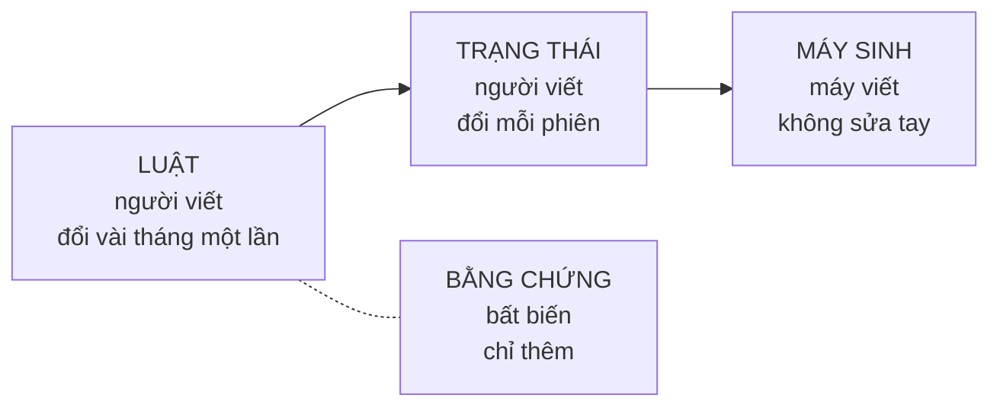

# Ark Repo Harness — nhà riêng của bộ khung

Đây là **nơi bộ khung được làm ra**, không phải bản để chép đi. Bản để chép đi nằm ở
[`template/`](template/), và nó **do máy sinh** — đừng sửa tay.

Bộ khung để làm gì: để một **phiên AI lạ** vào bất kỳ repo nào cũng hiểu ngay chuyện gì đang xảy
ra, không phải quét cả cây thư mục và không phải hỏi chủ repo câu nào.

> **Trạng thái: CHƯA CHỨNG MINH NGOÀI REPO GỐC.** Bộ khung này đã chạy thật trên đúng một repo —
> nơi nó được rút ra. Nó **chưa từng được đưa sang một repo khác nghề**. Đừng dùng cho việc quan
> trọng cho tới khi mốc đó đạt.
>
> Phiên bản thật đọc ở `package.json`, đổi gì thì đọc [CHANGELOG.md](CHANGELOG.md). **Đừng gõ số
> phiên bản vào file này** — nó sẽ lệch.

## Bạn muốn gì?

| Bạn muốn… | Làm gì |
|---|---|
| Chưa biết gì, muốn bắt đầu | đọc [docs/HUONG-DAN.md](docs/HUONG-DAN.md) — có mục *"Trước khi bắt đầu — 30 giây"* |
| Hiểu bộ khung này làm được gì cho tôi | đọc [docs/TINH-NANG.md](docs/TINH-NANG.md) |
| Dựng một repo mới theo chuẩn | `npm run init -- <thư-mục> --ten "Tên repo"` |
| Xem một repo đang có cách chuẩn bao xa | `npm run assess -- <đường-dẫn-repo>` |
| Xem một trang có hình cho dễ nhìn | `npm run overview -- trang.html` rồi mở file đó bằng trình duyệt |
| Tra một thuật ngữ lạ | [docs/LEGEND.md](docs/LEGEND.md) |
| Sửa chính bộ khung | đọc [AGENTS.md](AGENTS.md) trước — đó là hiến pháp của repo này |

## Nguyên tắc gốc

**Mỗi lần AI phải hỏi bạn một câu, nghĩa là repo còn thiếu một chỗ để ghi câu trả lời đó.**
Đừng sửa bằng cách dặn AI đọc kỹ hơn. Sửa bằng cách thêm chỗ ghi, và bắt cổng kiểm kêu lên khi
chỗ đó bỏ trống.

Nguyên tắc số hai: **thứ gì máy đếm được thì máy đếm** — con số, trạng thái, ngày tháng không gõ
tay.

## Bốn tầng — phân theo VÒNG ĐỜI, không theo chủ đề

| Tầng | Gồm gì | Ai ghi | Đổi khi nào |
|---|---|---|---|
| **LAW** | luật, vai, kiến trúc, hướng dẫn | người | vài tháng |
| **STATE** | trạng thái, việc mở, bàn giao | người | mỗi phiên |
| **GENERATED** | số đo, bản đồ, bảng tổng | **máy** | mỗi lần sinh |
| **EVIDENCE** | bằng chứng, log, quyết định đã chốt | bất biến | **chỉ thêm** |

Luật con: không trộn hai tầng vào một file; không để hai file cùng tầng nói cùng một điều.

## Repo này có gì

| Đường dẫn | Tầng | Việc của nó |
|---|---|---|
| [AGENTS.md](AGENTS.md) | LAW | Hiến pháp một trang. Mục 2 là **bản duy nhất** của danh sách "việc phải hỏi Đức"; mục 6 là bản đồ file |
| [CLAUDE.md](CLAUDE.md) | LAW | Stub trỏ về `AGENTS.md`, để công cụ nào cũng tìm được luật |
| `.repo-structure.json` | LAW | Hình dạng repo: đơn vị nằm đâu, thư mục nào có chủ nào, phép kiểm nào chặn |
| [docs/](docs/HUONG-DAN.md) | LAW | Hướng dẫn · tính năng · sổ tay AI · lịch bảo trì · lộ trình · bản mẫu · lưu đồ · quyết định (ADR) |
| [STATUS.template.md](STATUS.template.md) | LAW | Khuôn khai trạng thái cho mỗi đơn vị công việc |
| [STATUS.md](STATUS.md) · [HANDOFF.md](HANDOFF.md) | STATE | Trạng thái repo này · nhật ký bàn giao giữa các phiên |
| `.agents/claims.json` | STATE | Bảng chủ sở hữu, chống hai phiên AI giẫm chân |
| `DASHBOARD.md` · `llms.txt` · `repo-map.json` | GENERATED | **Máy sinh, đừng sửa tay.** Sinh lại: `npm run dashboard` |
| [scripts/](scripts/) | máy | Bộ sinh trang · cổng kiểm cấu trúc · cổng đóng phiên · safe-push · claim · assess · init |
| [tests/harness-smoke.mjs](tests/harness-smoke.mjs) | máy | **Lưới đỡ của chính bộ khung** — mỗi khối ghim một chỗ đã hỏng thật ở repo sinh ra nó. Thêm test của bạn vào cùng thư mục, đừng xoá các khối có sẵn |
| [template/](template/) | GENERATED | Bản trích để mang sang repo khác. Sinh lại: `npm run template` |
| [CHANGELOG.md](CHANGELOG.md) | EVIDENCE | Bản này đổi gì so với bản trước. Chỉ thêm, không sửa khối cũ |

Bảng trên phải là **liên kết bấm được**, không phải chữ thường. Lý do: máy kiểm xem mỗi file có
được file nào trỏ tới không. **File không ai trỏ tới thì coi như không có** — và một bản mẫu
không ai tìm ra thì đúng là sẽ không ai dùng.

## Ba trang cố ý KHÔNG đi theo bản trích

`DASHBOARD.md`, `llms.txt`, `repo-map.json` — chúng nói repo *này* đang thế nào, nên mỗi repo
phải tự sinh lấy. Máy sinh thì đi theo gói; sản phẩm của máy thì không. Chép sản phẩm sang repo
khác là làm mọi repo cùng hiển thị trạng thái của repo gốc.

Bằng chứng, trạng thái thật và nhật ký bàn giao thật cũng vậy — chúng thuộc về từng repo.

## Phép thử nghiệm thu

Mở một chat AI **hoàn toàn mới**, dán đúng một dòng:

> *Đọc `llms.txt` ở gốc repo &lt;chủ&gt;/&lt;repo&gt; rồi cho tôi biết ba điều: repo có những đơn vị
> nào và cái nào đang sống, việc ưu tiên số 1 hiện tại là gì và thuộc đơn vị nào, tôi nên đọc
> file nào tiếp theo.*

**ĐẠT** khi nó nói được cả ba, **không hỏi lại câu nào**.
**KHÔNG ĐẠT** thì ghi lại **chính xác câu nó đã hỏi** — mỗi câu hỏi là một chỗ còn thiếu trong
repo. Bổ sung chỗ đó rồi thử lại. **Không sửa bằng cách dặn AI đọc kỹ hơn.**
