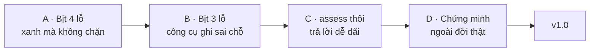

# Lộ trình tới v1.0

> *(File này viết cho AI. Đức không cần đọc — bản tóm tắt cho Đức nằm ở [STATUS.md](../STATUS.md).)*

> **v1.0 nghĩa là gì:** harness này dựng được một repo mới, đưa được một repo cũ lên chuẩn, và
> **mọi lớp bảo vệ nó quảng cáo đều đã được chứng minh là chặn thật**. Không phải "chạy được" —
> mà "chặn được khi bị phá".
>
> Nó **chưa** là v1.0, và lý do rất cụ thể: audit độc lập vòng một trả về **REJECT** với 6 phát
> hiện mức NẶNG, trong đó **bốn cái là lớp bảo vệ báo xanh trong khi không chặn gì**.
> (Nhãn phiên bản hiện tại đọc ở `package.json`, đừng gõ lại vào đây.)

## Vì sao chưa gọi là v1.0

Bốn lỗ dưới đây đều có cùng hình dạng, và đó là hình dạng nguy hiểm nhất trong cả hệ thống này:

> **Gate in ra màu xanh, trong khi thứ nó hứa canh gác đã bị phá.**

Một gate hỏng-ồn-ào thì ai cũng thấy. Một gate **báo xanh sai** thì không ai thấy, và nó còn tệ
hơn không có gate — vì người ta ngừng tự kiểm khi đã có nó.

## Bốn khối, theo đúng thứ tự



### Khối A — Bịt bốn lỗ "xanh mà không chặn" · *chặn v1.0*

| # | Lỗ | Trạng thái | Chứng minh nó thật |
|---|---|---|---|
| A1 | **Bảo vệ evidence chỉ soi cây làm việc, không soi commit** | **ĐÃ VÁ 03/09** — nay soi cả commit, và `--no-renames` để rename không lách qua | Sửa rồi commit một file evidence → gate cũ vẫn in `[XANH] Bằng chứng cũ nguyên vẹn`. Mà quy trình lại bắt chạy gate **sau** khi commit — nên đây là đường lọt chính, không phải ca hiếm |
| A2 | **`mutability: "append-only"` trong cấu hình bị bỏ qua** | **ĐÃ VÁ 03/09** — nay đọc thẳng `mutability` trong cấu hình, không dò tên thư mục nữa | Code cũ dò tên bằng regex cứng (`evidence`/`pilot`/`batch`). Khai `records/` là append-only rồi sửa file cũ → gate xanh. Cấu hình nói một đằng, code làm một nẻo |
| A3 | **Phép "file mới đã khai vào bản đồ"** chỉ tìm tên thư mục ở bất kỳ đâu trong luật | **ĐÃ VÁ 03/09** — nay đọc đúng khối bản đồ, và "không tìm thấy bản đồ" là một lỗi riêng | Thêm `scripts/cong-cu-la.mjs` mà bản đồ không hề nhắc → vẫn báo "Mọi thứ mới đều đã khai". Đây là **phép kiểm rỗng nghĩa thứ bảy** tìm được trong ba ngày |
| A4 | **Bộ trích nhận diện "luật riêng của nghề" bằng một danh sách từ khoá cố định** | **ĐÃ VÁ 03/09** — nay so dấu vân tay của TOÀN BỘ phần luật chung, nên mọi thay đổi đều bị bắt | Viết một luật nghề dùng từ ngoài danh sách → bộ trích không nhận ra, và câu luật riêng đó đi thẳng sang mọi repo khác |

**Luật chung của khối A:** mỗi bản vá phải kèm một fixture **dựng được ca hỏng**, và phải qua
mutation test. Vá mà không dựng nổi ca hỏng thì không biết đã vá gì.

### Khối B — Bịt ba lỗ "công cụ ghi sai chỗ" · *chặn v1.0*

| # | Lỗ | Trạng thái |
|---|---|---|
| B1 | `init-repo --ten "X" <đích>` dựng repo ở thư mục tên `X`, bỏ qua `<đích>` | **ĐÃ VÁ 03/09** + ghim hai thứ tự tham số |
| B2 | Luật bắt dùng `claim.mjs` mà file đó **không tồn tại** trong repo | **ĐÃ VÁ 03/09** — nay đi theo bản trích, và bốn khoá vùng khai đủ |
| B3 | `init-repo` **kiểm thư mục trống trước, rồi mới ghi** — hai bước rời nhau | Còn mở. Nếu có ai đó ghi vào thư mục ngay giữa hai bước thì nó ghi đè lên. Xác suất thấp, nhưng có thật. Sửa: ghi bằng chế độ tạo-độc-quyền, hoặc chấp nhận và ghi rõ giới hạn |

### Khối C — Làm `assess` thôi trả lời dễ chịu · *chặn v1.0*

`assess` là công cụ để **quyết định có bỏ công migrate hay không**. Một bộ đo luôn nói "gần đạt"
thì vô hại về kỹ thuật và tai hại về quyết định.

**Bốn ca nó nói "đạt" trong khi thật ra nó không đọc được:**

- **C1** — repo có file cấu hình nhưng file đó **hỏng, đọc không nổi** → công cụ báo "thiếu file"
  và vẫn chấm điểm cao nhất. *Không có* và *có mà đọc không được* là hai chuyện khác nhau.
- **C2** — thư mục `scripts/` thật ra là một **lối tắt trỏ ra ngoài repo** → vẫn chấm điểm cao
  nhất, chi phí 0.
- **C3** — trỏ vào một file thay vì một thư mục → công cụ **văng lỗi kỹ thuật** thay vì nói
  "sai đường dẫn".
- **C4** — danh sách miễn trừ khai một kiểu, công cụ đọc một kiểu khác → **miễn trừ bị bỏ qua
  im lặng**.

### Khối D — Chứng minh ở ngoài đời · *điều kiện cuối của v1.0*

Ba khối trên làm harness **đúng**. Khối này làm nó **được chứng minh**.

- **D1** — migrate **một** repo thật, đang sống, khác nghề. Quy trình
  `CHUYEN-REPO-LEN-CHUAN.md` hiện là **giả thuyết**; vài bước sẽ sai, và lần chạy đầu là để tìm
  ra chúng.
- **D2** — sửa quy trình theo đúng chỗ vấp, ngay tại file đó.
- **D3** — audit vòng hai trên **một SHA đóng băng**.
- **D4** — gỡ nhãn `unproven`, đóng v1.0.

## Kỷ luật audit — một bài học từ vòng một

Vòng một trả về `REJECT — STALE_EVIDENCE`, và **một phần lỗi là của tôi**: HEAD đổi **ba lần**
trong lúc auditor đang chạy, rồi một thay đổi chưa commit lọt vào bản trích giữa chừng. Auditor
không nghiệm thu nổi một mục tiêu đang di chuyển.

**Từ vòng hai:** đóng băng một SHA, gửi đúng SHA đó, và **không đụng repo** cho tới khi có báo cáo.

## Cái KHÔNG thuộc v1.0

- Giao diện web, CI tự chạy, phát hành lên registry.
- Migrate hàng loạt. v1.0 chỉ cần chứng minh **một** lần migrate thật.
- Thêm gate mới. Bốn gate hiện có mà chặn thật thì tốt hơn tám gate mà hai cái báo xanh sai.

## Đo bằng gì để biết đã tới v1.0

```bash
npm test                       # mọi phép kiểm xanh, và mỗi lớp bảo vệ có một fixture dựng được ca hỏng
npm run bootstrap              # 0 đỏ
npm run assess -- <repo-thật>  # chạy được trên một repo KHÔNG phải harness
```

Cộng thêm một điều không đo bằng lệnh được: **một repo thật khác nghề đã chạy trên harness này,
và người vận hành nó không phải hỏi lại gì.**
