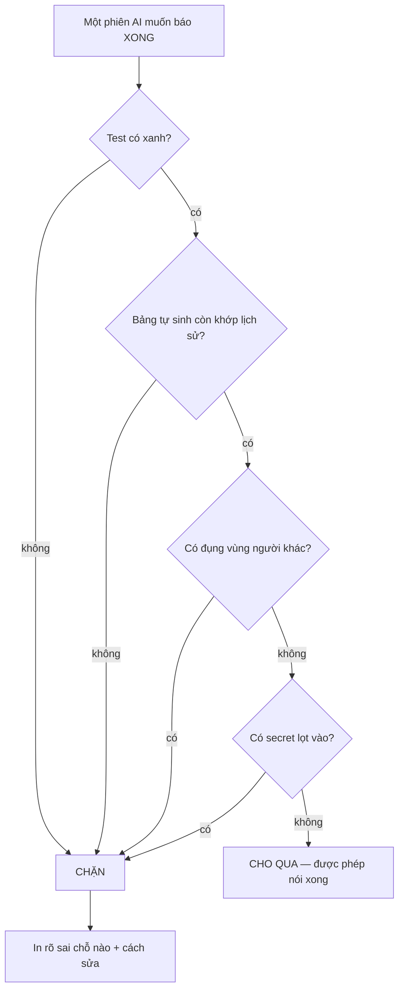

# Nó làm được gì cho bạn

> Viết cho người **không đọc code**. Đọc bảng là đủ. Phần dưới bảng chỉ giải thích thêm cho ai
> muốn biết vì sao.

## Cửa kiểm canh những gì

Một phiên AI không được tự nhận là đã xong. Nó phải đi qua cửa này:

## Tám việc nó làm hộ bạn

| Nó canh gì | Không có nó thì | Lệnh |
|---|---|---|
| Không cho báo "xong" khi việc chưa xong | "xong" thành lời tự khai, không ai kiểm được | `npm run gate -- --as <tên-phiên>` |
| Không cho hai người sửa cùng một chỗ | người ghi sau xoá việc người ghi trước, **không ai biết** | `node scripts/claim.mjs --take <vùng> --as <tên-phiên>` |
| Không cho đẩy nhầm việc của người khác | việc chưa được duyệt bị công bố ra ngoài | `npm run push -- --as <tên-phiên>` |
| Bảng trạng thái tự viết, không ai gõ tay | bảng nói một đằng, repo một nẻo — và bảng thì luôn đẹp hơn | `npm run dashboard` |
| Trang có hình cho người xem | không có gì đưa cho người không đọc code | `npm run overview -- <file.html>` |
| Bản đồ "sắp làm X thì mở file nào" | tài liệu vẫn có, nhưng không ai tìm ra, nên coi như không có | (bảng ở `AGENTS.md` mục 6) |
| Đo một repo cách chuẩn bao xa, **trước khi** bỏ công | quyết định làm hay không làm dựa trên cảm giác | `npm run assess -- <đường-dẫn-repo>` |
| Dựng một repo mới bằng một lệnh | mỗi repo mới là một lần chép tay, mỗi lần chép tay lệch đi một chút | `npm run init -- <thư-mục> --ten "Tên repo"` |

Ngoài tám việc trên còn hai thứ không có lệnh, vì chúng là **thói quen được ghi thành luật**:

- **Sổ tay bắt buộc cho việc lặp lại.** AI đọc danh sách kiểm rồi làm theo, không tự nghĩ cách
  mới mỗi lần. *Không có nó:* sau mười phiên thì không còn "cách làm của repo này" nữa.
- **Lịch bảo trì định kỳ.** Repo tự có lịch quét liên kết chết, tài liệu quá hạn, cảnh báo tồn
  đọng, quyền bị bỏ quên. *Không có nó:* nợ tích dần cho tới lúc không ai dám động vào.

## Ba chỗ đáng giải thích thêm

**Vì sao cửa kiểm không có đường vòng.** Cửa này chạy toàn bộ bài kiểm tra, đối chiếu các trang
tự sinh với lịch sử thật, và xem người làm có đụng phần của người khác không. Đỏ thì chưa xong —
và **không được nới cửa cho nó xanh**. Nới cửa là phá chính thứ đang canh mọi thứ khác.

**Vì sao chia vùng.** Repo chia thành vài vùng, mỗi vùng chỉ một người giữ tại một thời điểm.
Vùng đã có chủ thì chỉ được đọc. Hai AI cùng sửa một file là chuyện đã xảy ra thật, và nó im
lặng: cả hai đều báo xong.

**Vì sao `assess` không cho ra một phần trăm.** Nó chấm 0–3 và tách chi phí thành **ba loại việc
khác giá**: *thả* (chép là xong) · *viết* (người phải ngồi viết) · *soi* (có rồi nhưng lệch, phải
mở ra đọc). *"72% đạt chuẩn"* có thể là nửa giờ, cũng có thể là một buổi — bạn không lên lịch
được bằng con số đó.
