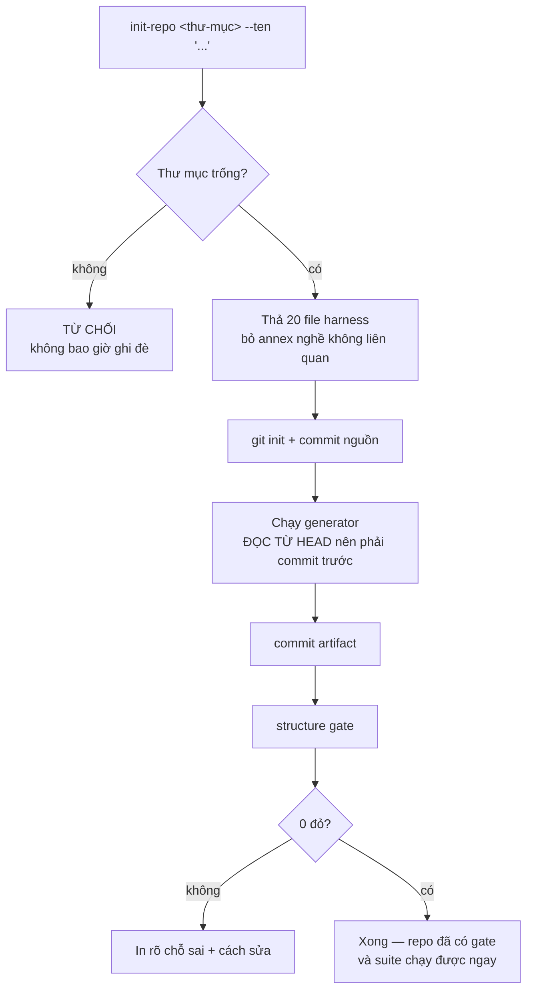

# Dựng một repo mới từ harness

Dùng khi thư mục đích **trống**. Repo đang có việc thì xem
[đưa repo cũ lên chuẩn](02-dua-repo-cu-len-chuan.md).



## Lệnh

```bash
node scripts/init-repo.mjs <thư-mục-đích> --ten "Tên repo của bạn"
```

Thêm `--kho-nghe` nếu repo bạn **cũng** làm nghề tự động hoá trình duyệt và muốn giữ annex mẫu.

## Ba việc phải làm ngay sau đó

| | Vì sao |
|---|---|
| Sửa mục 6 của `AGENTS.md` | Đó là bản đồ file của **riêng repo bạn**. Bỏ trống thì phiên AI sau không biết mở file nào |
| Khai `units` và `areas` trong `.repo-structure.json` | Gate đọc chỗ này thay vì đoán hình dạng repo |
| Thêm test của bạn vào `tests/` | Suite seed chỉ kiểm chính harness, không kiểm code của bạn |

## Cạm bẫy

**Đừng bật `bootstrap.blocking` ngay.** Bật chặn khi repo đang đỏ là tự khoá repo ở phiên đầu
tiên. Chạy vài phiên cho sạch rồi mới bật dần.
