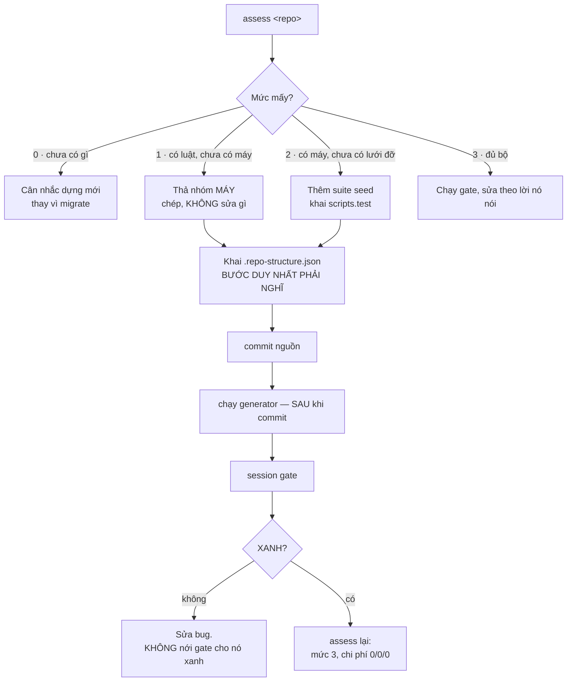

# Migrate một repo đang sống

**Trạng thái: chưa từng chạy trên repo thật khác nghề.** Vài bước dưới đây sẽ sai, và lần chạy
đầu tiên là để tìm ra chúng — không phải để nghiệm thu.

## Bốn cạm bẫy — cả bốn đều đã xảy ra thật

| Bẫy | Hậu quả |
|---|---|
| Bật `bootstrap.blocking` ngay từ đầu | Repo bị khoá ở phiên đầu tiên, không ai vào được |
| Chia `areas` quá nhỏ khi chưa biết ai làm gì | Tự tạo tranh chấp claim cho việc không hề chồng nhau |
| Chạy generator trước khi commit nguồn | Artifact dựng từ HEAD cũ — **hỏng im lặng**, trang vẫn đẹp |
| Sửa harness trong lúc chép sang | Hai nhánh của cùng một công cụ, rồi chúng trôi khỏi nhau |

## Việc KHÔNG thuộc workflow này

- **Dọn nợ cũ của repo đích.** Migrate là thêm một lớp, không phải viết lại repo.
- **Đổi luật repo đích cho giống repo nhà.** Annex sinh ra đúng để chỗ đó khác nhau.

Chi tiết từng bước: [docs/protocols/CHUYEN-REPO-LEN-CHUAN.md](../protocols/CHUYEN-REPO-LEN-CHUAN.md)
