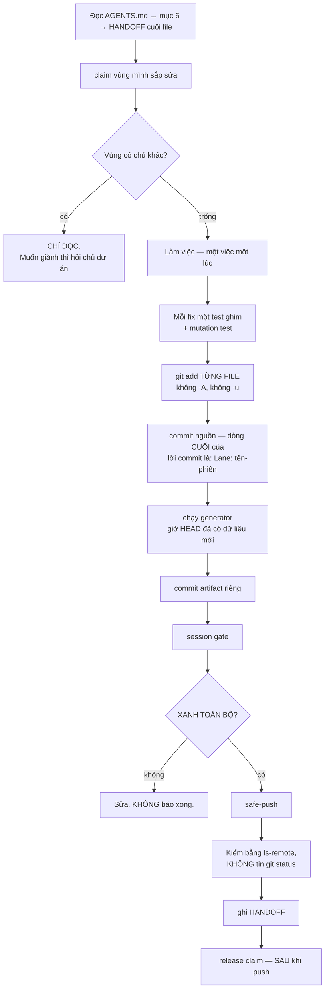

# Một phiên làm việc

Đây là workflow chạy nhiều nhất — mỗi phiên AI đều đi qua nó. Thứ tự ở cuối **không đổi được**.



## Bốn chỗ dễ sai nhất, đều đã trả giá

**`git add -A` hoặc `-u`** cuốn theo việc chưa commit của phiên khác. Chỉ khác nhau một chữ cái,
và cả hai đều cuốn. Liệt kê từng file.

**Chạy generator trước khi commit** thì nó dựng lại từ HEAD cũ. Artifact vẫn sinh ra, chỉ là nói
về một quá khứ khác — hỏng im lặng.

**Release claim trước khi push** thì commit chưa push của bạn rơi vào vùng không chủ, và gate của
phiên sau đỏ oan. Giữ tới khi push xong.

**Tin `git status -sb`** sau khi push. Nó đọc ref remote-tracking **cục bộ** — đúng thứ có thể
sai. Hỏi thẳng máy chủ:

```bash
git ls-remote origin refs/heads/main
git merge-base --is-ancestor <sha-của-bạn> <sha-vừa-lấy>
```

Mã thoát 0 = commit đã thật sự lên.
