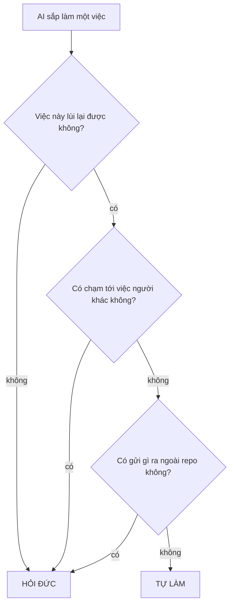

# AGENTS.md — Hiến pháp repo (đọc đầu tiên, mọi AI)

> Đây là **Tầng 1**: luật chung, cố tình giữ ngắn 1 trang. Đọc hết trước khi gõ dòng đầu tiên.
> Chi tiết kỹ thuật KHÔNG nằm ở đây — xem mục "Sổ tay mở khi cần" bên dưới.
> Chủ dự án là **Đức** (non-tech, tiếng Việt, câu ngắn). Đức là người chốt duy nhất.

## 0. Ba việc phải làm, theo đúng thứ tự

1. **Mở phiên:** đọc file này → đọc `AGENTS.md` của package mình sắp đụng → đọc `HANDOFF.md`
   của package đó (phần cuối = trạng thái mới nhất).
2. **Làm việc:** một việc một lúc. Phát sinh việc ngoài phạm vi → ghi vào `BACKLOG.md`, không tự làm.
3. **Đóng phiên:** chạy cổng kiểm dưới đây. Đỏ thì chưa xong.

```bash
node scripts/session-check.mjs --as <tên-phiên-của-bạn>
```

Không được báo "xong" khi cổng kiểm chưa xanh. Không được tự sửa cổng kiểm cho nó xanh.

**Push thì KHÔNG dùng `git push`** — dùng:

```bash
node scripts/safe-push.mjs --as <tên-phiên-của-bạn>
```

Lý do: nhiều phiên AI dùng chung một thư mục git, nên `git push` của bạn **cuốn theo commit của
mọi phiên khác** — đã xảy ra thật 26/08. `safe-push` liệt kê rõ sắp đẩy gì của ai, và từ chối
nếu bạn đang cuốn theo việc người khác.

## 1. Ai giữ package nào — chống hai AI giẫm chân

Bảng chủ sở hữu là `.agents/claims.json`. **Một vùng chỉ có MỘT phiên AI được ghi tại một thời điểm.**

**Nhận và trả quyền bằng lệnh, đừng sửa file bằng tay:**

```bash
node scripts/claim.mjs --list
node scripts/claim.mjs --take <khoá> --as <tên-phiên> --task "một câu"
node scripts/claim.mjs --release <khoá> --as <tên-phiên>
```

Sửa tay là đọc-sửa-ghi, và ngày 02/09 đã có một quyền **bị ghi đè im lặng** vì thế: hai phiên
cùng đọc thấy "trống" rồi cùng ghi tên mình, người ghi sau thắng, người ghi trước không hề biết.

- Vùng đang có chủ, mà chủ không phải bạn → **chỉ được đọc, tuyệt đối không sửa**.
- Vùng trống chủ → nhận rồi làm.
- Muốn giành vùng người khác đang giữ → **hỏi Đức**, không tự lấy.

**Gốc repo chia làm NHIỀU khoá.** Nhận đúng vùng mình đụng, không nhận cả gốc repo. Cổng đóng
phiên sẽ nói tên khoá còn thiếu. Ai chia vùng thì khai `steward` trong khối `areas` của
`.repo-structure.json`.


**Hai file được MIỄN, và lý do khác nhau:** `.agents/claims.json` (nhận/trả quyền là thao tác
hành chính — không miễn thì không ai trả lại được quyền) và `HANDOFF.md` ở gốc (luật mục 7 bắt
MỌI phiên ghi Log — nhưng **chỉ miễn khi chỉ thêm dòng**; sửa HAY XOÁ dòng cũ là viết lại lịch sử của
phiên khác).

Đây không phải hình thức: ngày 02/09 đo được **98 trong 127 commit (77%) chạm gốc repo** — một
khoá duy nhất là điểm nghẽn thật, không phải lý thuyết.

## 2. Sáu việc PHẢI hỏi Đức trước

> **Đây là BẢN DUY NHẤT của danh sách này trong cả repo.** File khác chỉ được trỏ sang đây,
> tuyệt đối không chép lại — ba bản chép tay đã từng nói ba kiểu khác nhau.

| # | Việc | Vì sao không lùi lại được |
|---|---|---|
| 1 | Xoá file, hoặc sửa dữ liệu gốc | Mất là mất, không dựng lại được |
| 2 | Đẩy kèm commit của phiên khác (`--carry`) | Công bố việc chưa ai duyệt |
| 3 | Giành vùng một phiên khác đang giữ | Người kia mất việc mà không biết |
| 4 | Gửi bất cứ gì ra ngoài (mail, tin nhắn, đăng công khai) | Ra rồi thì không rút về được |
| 5 | Tạo automation tự chạy | Nó chạy cả lúc không ai nhìn |
| 6 | Đổi luật an toàn của repo | Đổi luật là đổi thứ đang canh mọi thứ khác |

Ngoài sáu việc này, AI tự làm. Nguyên tắc phía sau: **AI tự do trong phạm vi làm repo tốt lên
và lùi lại được. Cái gì không lùi lại được, hoặc chạm tới việc người khác, thì hỏi.**



**"Luật an toàn" ở hàng 6 là năm thứ này:** *thử lại* (hỏng thì thử mấy lần rồi bỏ) · *dừng khẩn*
(gặp chuyện thì dừng hẳn) · *quy trách nhiệm* (việc nào cũng ghi rõ ai làm) · *lưu trạng thái*
(làm dở thì nhớ tới đâu) · *làm đúng một lần* (chạy hai lần không được ra hai kết quả).

Repo có phụ lục nghề (`docs/ANNEX-*.md`) thì việc phụ lục liệt kê cũng phải hỏi — phụ lục chỉ
được **thêm** vào sáu việc trên, không được bớt.

**Commit và push được tự làm** — Đức chốt 2026-08-26, áp cho MỌI AI — nhưng chỉ khi đủ cả ba:
(1) việc đã hoàn tất trọn vẹn; (2) cổng kiểm XANH TOÀN BỘ, và với code thì đã qua audit độc lập;
(3) đẩy bằng `safe-push.mjs`. Lý do đổi luật: Đức không đọc code trên máy, GPT audit qua GitHub —
nên commit chưa push là **vô hình** với vòng kiểm tra chéo. Push sớm = được audit sớm.

Vẫn phải hỏi: force-push, sửa lịch sử, merge vào `main` — và mục 2 hàng 2 ở trên.

## 3. Năm luật vàng

1. **Không đoán.** Mọi khẳng định về một hệ thống thật phải có bằng chứng ĐO ĐƯỢC. Cần bằng
   chứng mới → tự đi lấy, đừng mượn mắt Đức. Lấy bằng cách nào là việc của phụ lục nghề.
2. **Mỗi fix một test ghim.** Và fixture phải DỰNG NỔI ca hỏng — một phép kiểm không phân
   biệt được hai nhánh là đồ trang trí, dù nó xanh.
3. **Không làm yếu lớp bảo vệ đã có** để cho test xanh. Sửa bug được; gỡ bảo vệ thì không.
4. **Kiểm chứng độc lập mọi báo cáo của AI khác.** Tự chạy lại test, tự đọc lại diff.
   Agent phụ báo "xong" không phải bằng chứng.
5. **Viết cho mắt Đức đọc.** Đức đọc không hiểu = lỗi hệ thống, viết lại đơn giản hơn.
   Chữ operator nhìn thấy: tiếng Việt. Mã lỗi (CODE): tiếng Anh.

## 4. Vùng cấm sửa

- Thư mục bằng chứng — khai `"mutability": "append-only"` trong `.repo-structure.json`.
  **Chỉ được THÊM mới**, không sửa, không xoá, không tạo lại. Tên thư mục là việc của repo bạn.
- Không bao giờ để token / mật khẩu / file pairing vào repo.
- Những điều cấm riêng của nghề repo bạn — xem `docs/ANNEX-*.md`. Chưa có phụ lục thì bỏ dòng này.

## 5. Vai từng AI

| AI | Việc chính | Không được |
|---|---|---|
| **Đức** | Chốt mọi thứ | — |
| **Claude** | Kiến trúc, phản biện, audit độc lập, điều phối | Push khi cổng kiểm chưa xanh |
| **Codex** | Code theo brief, audit độc lập | Tự mở rộng phạm vi ngoài brief |
| **Antigravity** | Dựng UI, tạo giao diện | Sửa lớp an toàn / runner / bridge |

Ba AI có thể cùng lúc trong repo, nhưng **khác package** (mục 1).

**Cửa vào của từng AI:** Claude tự đọc `CLAUDE.md` gốc → trỏ sang file này. Codex tự đọc
`AGENTS.md` gốc. Antigravity thì Đức phải dán **một câu mở màn** mỗi phiên: *"Đọc AGENTS.md ở
gốc repo trước khi làm gì."* — thử live 26/08 cho thấy nó đọc và tuân luật, nhưng chưa chứng
minh được nó **tự** nạp lúc mở phiên.

## 6. Sổ tay mở khi cần — Tầng 2

> **Bảng này là BẢN ĐỒ RIÊNG CỦA REPO BẠN.** Bộ khung điền sẵn các dòng cho chính những file
> nó mang theo — vừa để repo mới xanh ngay, vừa làm mẫu cho định dạng. **Thêm dòng của bạn vào
> đây; đừng xoá cái đang đúng.**

Luật chung nằm ở các mục trên. Chi tiết kỹ thuật thì nằm ở các file mà bảng dưới trỏ tới —
không đọc trước, tới việc nào thì mở sổ tay đó.

| Khi bạn sắp… | Mở file |
|---|---|
| Hiểu bộ khung này gồm gì và dùng thế nào | [README.md](README.md) |
| Khai trạng thái cho một đơn vị công việc | [STATUS.template.md](STATUS.template.md) |
| Ghi một quyết định kiến trúc | bản mẫu [docs/_TEMPLATE-adr.md](docs/_TEMPLATE-adr.md) · luật [docs/adr/0000-…](docs/adr/0000-ghi-nhan-quyet-dinh-kien-truc.md) |
| **Tra nhanh người chốt đã chốt gì, ngày nào** | [decisions.md](decisions.md) — sổ quyết định, **chỉ thêm**, luật mục 7 bắt ghi vào đây. Lập luận dài thì viết ADR, file này giữ một dòng trỏ sang |
| Viết một tài liệu nghiên cứu | [docs/_TEMPLATE-study.md](docs/_TEMPLATE-study.md) |
| Viết đề bài cho một phiên AI | [docs/_TEMPLATE-brief.md](docs/_TEMPLATE-brief.md) |
| **Sắp làm cùng lúc với AI khác, hoặc sắp SỬA một trong bốn cơ chế đa phiên** | [docs/protocols/MULTIFLOW.md](docs/protocols/MULTIFLOW.md) — bốn cơ chế (bảng chủ sở hữu · nhãn `Lane:` · cổng đóng phiên · cổng xuất bản), một ngày làm việc 5 bước, **năm bất biến kèm lý do từng cái**, và quy trình đổi cơ chế có **đột biến kiểm bắt buộc**. Mục 1–3 viết cho người không code. **Cố ý không chứa số đo, không kiểm kê chốt, không bảng mã lỗi** — ba thứ đó khác nhau ở từng repo và mục nhanh hơn ai kịp sửa, nên nó chỉ đưa câu lệnh để tự đo |
| Biết phiên trước làm tới đâu | [HANDOFF.md](HANDOFF.md) — đọc phần **cuối** file |
| Biết repo đang nợ gì về cấu trúc | chạy `npm run bootstrap` |
| **Đến hạn bảo trì · repo im ắng lâu ngày · muốn biết repo đang NẶNG bao nhiêu** | [docs/BAO-TRI-DINH-KY.md](docs/BAO-TRI-DINH-KY.md) — ba nhịp giữ repo đúng, cộng **nhịp DỌN** giữ repo rẻ. Đo bằng `npm run can-nang`; ngân sách khai được ở `budget` trong `.repo-structure.json` |
| **Phát sinh việc ngoài phạm vi phiên mình — chỗ ghi nợ, luật mục 0 bắt** | [BACKLOG.md](BACKLOG.md) — nhóm `## P<n>`, mỗi mục `### <MÃ>-<số> · <tiêu đề>`, đóng thì **gạch mã** chứ đừng xoá. `npm run what-next` đọc thẳng file này; sai quy ước một ký tự là mục biến mất khỏi bản đồ việc |
| **Sắp BÁO CÁO trạng thái cho người chốt — kiểm xem điều mình sắp nói có khớp nguồn thẩm quyền không** | `npm run state-check` — **không phải cổng đóng phiên**: cổng kia hỏi "việc tôi làm đẩy được chưa", cái này hỏi "điều tôi sắp nói có đúng không". Ba mã thoát, cố ý không gộp: `OK` · `MISMATCH` · `UNKNOWN` — không đọc được thì nói KHÔNG BIẾT, không nói OK. **Chỉ đọc, không đòi khoá nào** |
| **Không biết làm gì tiếp, hoặc muốn biết việc nào chạy song song được ngay** | `npm run what-next` — bản đồ việc, giao ba nguồn: bảng quyền × sổ nợ từng đơn vị × sổ ý tưởng. Luật song song nó cưỡng chế chỉ một câu: hai việc song song được **khi và chỉ khi** thuộc hai khoá khác nhau và cả hai đang trống. **Chỉ đọc, không đòi khoá nào** |
| **Là phiên ĐIỀU PHỐI: người chốt hỏi "đang có gì · làm gì tiếp · việc nào chạy song song được"** | [docs/protocols/ORCHESTRATOR.md](docs/protocols/ORCHESTRATOR.md) — sổ tay vai điều phối: luật mở phiên, **hàng rào vai cứng** (vai này KHÔNG code, KHÔNG debug, KHÔNG đề xuất bản vá), luật nạp báo cáo năm mục, lối ra bàn giao cho executor. **Đọc khối cảnh báo ở đầu file trước** |
| **Một phép kiểm tự nhiên đỏ với người vừa clone mà xanh trên máy bạn** | [.gitattributes](.gitattributes) — chốt kiểu xuống dòng cho CẢ repo, cả trong kho lẫn trong cây làm việc. Không có nó thì máy Windows tự đổi lúc lấy file ra, một commit có hai dạng byte, và `git status` nói SẠCH ở cả hai. Chốt một nửa — chỉ `text=auto` — thì kho sạch mà cây làm việc vẫn CRLF, tức bệnh còn nguyên |
| Hiểu bộ khung tự kiểm mình bằng gì, hoặc thêm test của repo bạn | [tests/harness-smoke.mjs](tests/harness-smoke.mjs) — bốn khối hạt giống · [tests/assistant-smoke.mjs](tests/assistant-smoke.mjs) — phép ghim của hai lệnh trên, khối cuối tự dựng một repo hình dạng khác hẳn rồi chạy thật trong đó. Chạy cả hai bằng `npm test` |
| Biết luật riêng của NGHỀ repo bạn (không phải luật chung) | phụ lục nghề: [docs/ANNEX-tu-dong-hoa-trinh-duyet.md](docs/ANNEX-tu-dong-hoa-trinh-duyet.md) là bản mẫu có thật · viết cái của bạn theo [docs/_TEMPLATE-annex.md](docs/_TEMPLATE-annex.md) |

**Vì sao phải là liên kết chứ không phải chữ thường:** phép kiểm độ sâu điều hướng (B6) đi theo
liên kết từ cổng vào máy đọc. File không ai trỏ tới thì máy coi là không tới được — và một bản
mẫu không ai tới được thì đúng là sẽ không ai dùng. Đo thật lúc dựng bộ khung này: để bảng rỗng
thì **4 file** rơi ra ngoài bản đồ, kể cả chính `README.md`.

**Luật vàng số 4 áp ở đây:** thêm file hoặc thư mục mới thì phải khai một dòng vào bảng này.
Không khai = không tồn tại. Cổng đóng phiên có phép kiểm này.
## 7. Đóng phiên — ghi lại 3 thứ

1. Một dòng Log vào `HANDOFF.md` của package: làm gì, kết quả số, còn gì mở.
2. Quyết định mới của Đức → `decisions.md`.
3. Gặp lỗi mới ở một hệ thống bên ngoài → thêm 1 dòng vào bảng lỗi của sổ tay, **và** cân
   nhắc thêm 1 phép kiểm vào `scripts/session-check.mjs`.

> Luật nào không kiểm được bằng máy thì sớm muộn cũng bị bỏ qua. Đó là lý do có cổng kiểm.

## 8. Thêm một luật thì phải bớt một luật

Mỗi luật ở đây đều hợp lý **lúc thêm vào**. Cộng lại thì không: AI mất nửa phiên chỉ để đọc luật,
luật bắt đầu mâu thuẫn nhau, đóng phiên lâu tới mức người ta bỏ qua cổng. Bộ khung chết vì phình
chứ hiếm khi chết vì thiếu.

Nên trước khi thêm một luật, một phép kiểm hay một tài liệu, trả lời đủ ba câu:

1. **Đã có chuyện gì xảy ra thật chưa?** Chưa thì đừng thêm — viết vào `BACKLOG` và chờ.
2. **Nó thay chỗ cái nào?** Không thay được cái nào thì nói rõ vì sao đáng thêm hẳn.
3. **Dựng nổi ca hỏng cho nó không?** Không dựng nổi thì nó là chữ, không phải luật.

Cân nặng được ĐO, không để cảm tính — cảm tính luôn nói "thêm một cái nữa thì có sao đâu".
Bộ khung KHÔNG mang theo công cụ đo, vì ngân sách là con số của RIÊNG repo bạn: chốt lấy vài
ngưỡng (số luật · số phép kiểm · số tài liệu · số phút đóng phiên) rồi tự đếm. Quá ngưỡng thì
phải BỚT trước khi nghĩ tới nới.

